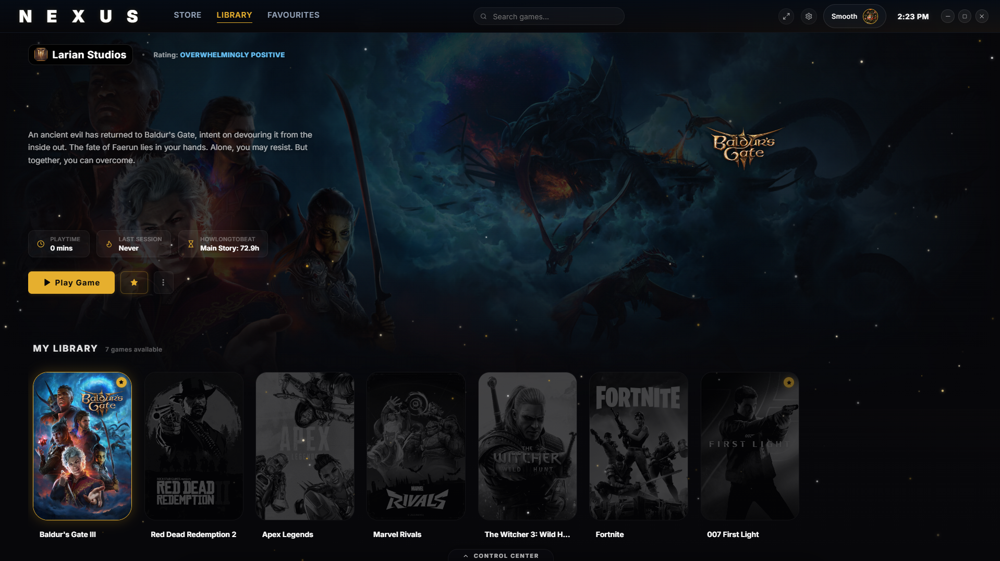
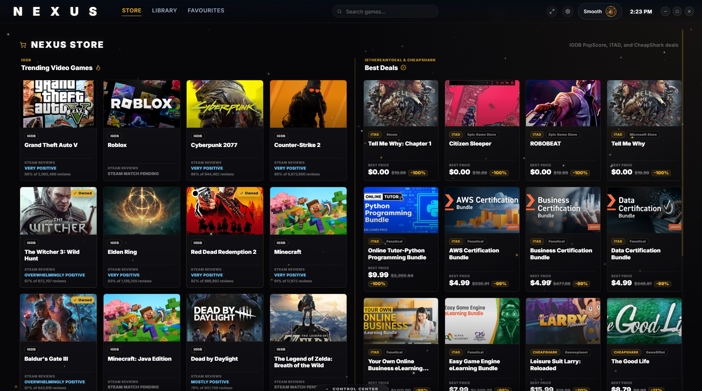
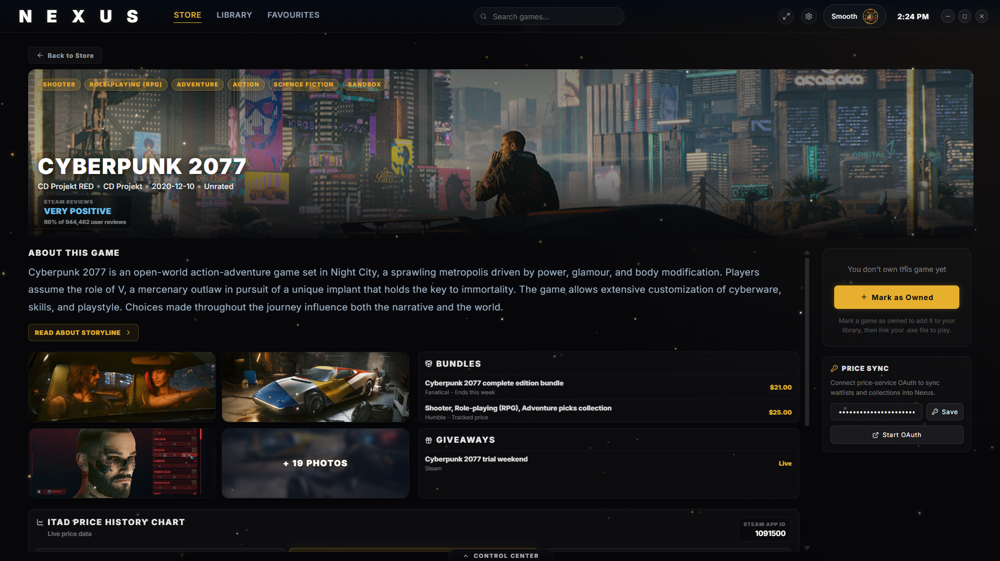
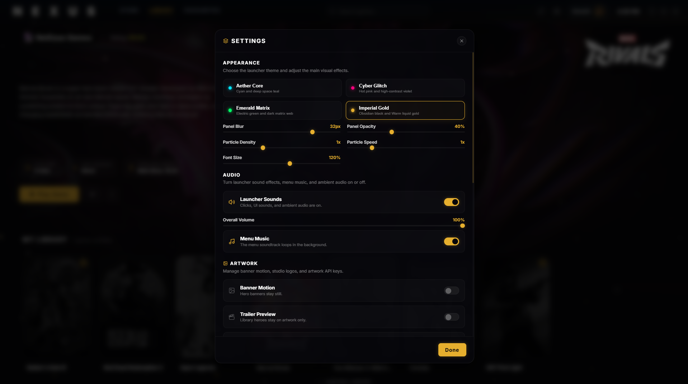

# Nexus Launcher

## Professor Convenience: Project Description And Contributions

For the 1-2 page project summary, workflow explanation, and detailed team contribution breakdown, see [`docs/PROJECT_DESCRIPTION.md`](docs/PROJECT_DESCRIPTION.md).

> **Electron app disclaimer:** Nexus Launcher is designed to be run as a desktop Electron app. The Vite localhost URL is only an internal renderer server for Electron during development, so opening that localhost link directly in a browser is not the intended or supported way to use the project.

**A premium Windows game launcher built for players who want their library to feel as good as the games inside it.**

Nexus Launcher turns a local game collection into a polished, controller-friendly command center. It brings your games, artwork, launch actions, discovery feeds, deals, trailers, playtime context, and customization settings into one cinematic desktop experience.

Whether you want a cleaner way to launch installed games, a richer way to browse your favorites, or a storefront-style discovery view without leaving your launcher, Nexus gives your library the kind of presentation usually reserved for console dashboards and premium gaming clients.

> Current distribution note: Nexus Launcher does not yet ship with a packaged Windows installer. To try it today, clone the repository, install dependencies, and run the Electron app locally.

## Preview

**Library**  



**Discovery and Deals**  



**Game Details**  



**Customization**  




## Why Nexus Launcher

### Your PC Library, Presented Like A Premium Console

Import local executables, scan folders for games, and launch them from a unified library built around large artwork, readable metadata, play actions, and fast navigation. Nexus is designed for players who want their PC setup to feel intentional rather than scattered across folders and shortcuts.

### Artwork That Makes Every Game Feel At Home

Nexus can enrich imported games with covers, hero banners, logos, icons, and media through Steam, SteamGridDB, and IGDB-backed lookups. The launcher also caches artwork locally in the desktop app so your library stays fast and visually consistent.

### Discovery Without Leaving The Launcher

The store view brings together IGDB PopScore trending games, Steam review context, trailers, screenshots, and owned-state awareness. Search can blend local library results with discovery results, letting you move from "what do I own?" to "what should I play next?" in one flow.

### Deals, Reviews, Playtime, And Compatibility

Nexus layers useful decision-making signals into the browsing experience:

- Best-price cards from IsThereAnyDeal and CheapShark.
- Steam review summaries when a Steam match is available.
- HowLongToBeat playtime estimates for supported games.
- Optional ProtonDB compatibility summaries for Steam-matched titles.

### Built For Keyboard And Controller Navigation

The interface uses real focusable controls and controller navigation attributes, so it works naturally from a desk setup or a couch setup. Controller hint overlays help make the launcher feel like a gaming-first interface rather than a web page pretending to be one.

### Make It Yours

Tune the launcher with themes, glass intensity, particle effects, font scale, banner motion, trailer preview behavior, studio logos, menu music, volume, and system status readouts. Nexus is meant to feel personal, not generic.

## Feature Highlights

- Unified desktop game library for imported executables.
- Folder scanning and manual executable import.
- Game launch tracking with playtime updates.
- Favorites gallery for spotlighting your best games.
- Rich library hero with artwork, metadata, launch controls, and trailer preview support.
- Store-style discovery view powered by IGDB, ITAD, and CheapShark integrations.
- Detailed game pages with media, reviews, price history, and ownership actions.
- SteamGridDB artwork search and batch artwork fetching.
- HowLongToBeat metadata lookup.
- Optional ProtonDB Linux compatibility display.
- Theme, audio, artwork, trailer, profile, and system settings.
- Keyboard and controller-aware navigation.
- Browser fallback behavior for parts of the renderer, with full native behavior in Electron.

## Tech Stack

- **Desktop shell:** Electron
- **Renderer:** React 18
- **Build tool:** Vite
- **UI icons:** lucide-react
- **Native bridge:** Electron preload script using `window.electronAPI`
- **Primary platform:** Windows desktop

## Installation

Nexus currently runs from source. You will need Node.js and npm installed.

1. Clone the repository:

```powershell
git clone https://github.com/NW0RK/UI-UX-Final-Project.git
cd UI-UX-Final-Project
```

2. Install dependencies:

```powershell
npm install
```

3. Start the desktop app in development mode:

```powershell
npm run dev
```

This starts the Vite renderer on port `5173`, waits for it to be ready, and then launches Electron.
Use the Electron window that opens. The localhost URL is only for Electron's renderer and is not meant to be opened directly in a browser.

## Optional API Setup

Nexus includes built-in credentials for the shared discovery and deal feeds used by the class project, so a fresh clone can load IGDB discovery and ITAD deal data without extra setup. You can still provide your own keys to avoid shared quota limits or to test against your own API apps.

Copy the example environment file:

```powershell
copy .env.example .env
```

Then fill in any credentials you want to override:

```env
STEAMGRIDDB_API_KEY=
IGDB_CLIENT_ID=
IGDB_CLIENT_SECRET=
```

What these unlock:

- `STEAMGRIDDB_API_KEY` improves cover, banner, logo, and icon fetching.
- `IGDB_CLIENT_ID` and `IGDB_CLIENT_SECRET` override the built-in IGDB discovery credentials for search, screenshots, details, and trailers.

The desktop app also exposes API credential controls in the Settings panel where supported.

## Developer Commands

Run the Electron app in development mode:

```powershell
npm run dev
```

Build the production renderer:

```powershell
npm run build
```

Preview the built Vite renderer only:

```powershell
npm run preview
```

Note: `npm run preview` previews the renderer and does not exercise the full Electron IPC/native desktop layer. Nexus Launcher should be used through Electron, not by opening the localhost renderer URL directly in a browser.

## Project Structure

```text
.
|-- main.js                  # Electron main process and native IPC handlers
|-- preload.js               # Context-isolated bridge exposed as window.electronAPI
|-- src/
|   |-- App.jsx              # Main React state, routing, persistence, and app flows
|   |-- main.jsx             # React entrypoint
|   |-- index.css            # Global styling, themes, layout, and focus rules
|   |-- components/          # Launcher views, overlays, panels, and UI components
|   |-- hooks/               # Keyboard and controller navigation helpers
|   `-- utils/               # Integrations, metadata helpers, artwork, audio, and data tools
|-- scripts/                 # Development helper scripts
|-- docs/                    # Architecture notes and project documentation
`-- audio/                   # Launcher audio assets
```

## Development Notes

- Renderer code should use `window.electronAPI` for native behavior.
- Do not import Electron APIs directly into React files.
- Preserve browser fallback behavior where it already exists.
- Keep game data fields consistent across imported games, store results, and saved records.
- Use `npm run build` as the baseline verification command. There is currently no automated test script in `package.json`.

## Status

Nexus Launcher is an active final project prototype with a polished desktop experience and several live-service integrations. It is ready to run locally from source, and future work could add packaged Windows releases through GitHub Releases.

## Security Notes

This codebase does not load any remote CDN scripts in the renderer. The only script loaded is the local `/src/main.jsx` module (`index.html:10`). All CDN downloads (Steam CDN images, SteamGridDB, IGDB, HowLongToBeat APIs) happen in the main process (`main.js`) via Node.js `https` — never as renderer-executed scripts.

If a remote script were somehow injected, the app's security settings (`main.js:1457-1462`) mitigate the damage:

| Setting | Effect |
| :--- | :--- |
| `nodeIntegration: false` | No `require()` / Node.js APIs in renderer |
| `contextIsolation: true` | Renderer cannot access `electronAPI` bridge directly — preload is isolated |
| `sandbox: true` | Chromium sandbox further restricts child process |
| `will-navigate` blocked | Prevents navigation to attacker URLs |
| `setWindowOpenHandler` | Only `https://` opens externally; action: 'deny' prevents new windows |

A compromised renderer script could still:
- Read/Write `localStorage`
- Call exposed IPC methods (no filesystem access, just the limited `electronAPI` surface)
- Manipulate the DOM / phish the user

But it cannot access the filesystem, execute shell commands, or reach Node.js/Electron internals — those are isolated in the main process behind IPC boundaries. The renderer controls `exePath` completely, and the main process calls `spawn()` on it with zero validation beyond `fs.existsSync()` (`main.js:1729-1732`).

### The Data Flow

```text
Renderer (App.jsx:1294)
  ──IPC──>  preload.js:21
              ──invoke──>  main.js:1727
                              spawn(exePath, [], ...)
```

The `exePath` comes from the game object stored/persisted in the renderer. If an attacker compromises the renderer (XSS, injected CDN script, devtools abuse), they can call:
```javascript
window.electronAPI.launchGame("malicious", "C:\\Windows\\System32\\cmd.exe")
```

### What the Attacker Can Do

| Capability | Details |
| :--- | :--- |
| Launch any `.exe` | No allowlist, no path restriction. Any file on disk `fs.existsSync()` passes. |
| No shell injection | `spawn` without `shell: true` — can't inject args via `&` or `;`, but they can pick any binary. |
| Spawn as user | Runs at the same OS user privilege level as the app. Not elevated. |
| Bypass game tracking | `child.unref()` + `detached: true` means the child outlives the launcher. |

### Existing Guardrails (and Gaps)

- `fs.existsSync(exePath)` — only checks the file exists, not what it is.
- `sandbox: true` + `contextIsolation: true` — makes compromise harder but doesn't prevent a compromised renderer from calling `electronAPI.launchGame()`.
- No path allowlisting, no canonical path check (e.g. rejecting paths outside Program Files / Steam directories), no digital signature verification.

**Bottom line:** If the renderer is compromised, the attacker gets arbitrary code execution at the user's privilege level by launching any executable on disk through the `launch-game` IPC handler.

### Hardcoded Credentials Disclaimer

There are shared third-party credentials committed to git and shipped to every client for the class-project prototype:

| File | Line | Credential |
| :--- | :--- | :--- |
| `src/utils/rawg.js` | 2 | `BUILTIN_RAWG_API_KEY = '10149f0743744f2c82250660ee23bfe2'` |
| `src/utils/itad.js` | 2 | `DEFAULT_ITAD_API_KEY = '3a90499d6e838ec7b1ca664f6004517df06e2aa8'` |
| `src/utils/itad.js` | 3 | `DEFAULT_ITAD_CLIENT_ID = 'c148f1514efb8478'` |
| `src/utils/itad.js` | 4 | `DEFAULT_ITAD_CLIENT_SECRET = '68dfada7b9d81f36cc171a0cded8176621930c2e'` |
| `main.js` | 62 | `DEFAULT_IGDB_CLIENT_ID = '331ozbtylxc949s6y4o2amakole28q'` |
| `main.js` | 63 | `DEFAULT_IGDB_CLIENT_SECRET = 'g6dhb4trtz2b69dckp5b4t6womkvbj'` |
| `scripts/igdbProxyPlugin.js` | 5 | `DEFAULT_IGDB_CLIENT_ID = '331ozbtylxc949s6y4o2amakole28q'` |
| `scripts/igdbProxyPlugin.js` | 6 | `DEFAULT_IGDB_CLIENT_SECRET = 'g6dhb4trtz2b69dckp5b4t6womkvbj'` |
| `src/components/SettingsPanel.jsx` | 21 | `'331ozbtylxc949s6y4o2amakole28q'` (IGDB Client ID fallback display) |

**Why it matters:**
- **Anyone can read them** — the source is public in git, and the values are shipped as plaintext in browser bundles. Opening devtools or viewing the network tab reveals all of them.
- **API key abuse** — the RAWG key (`rawg.js:33`) and ITAD key (`itad.js:113-115`) are sent in renderer-side `fetch()` calls (not proxied through the main process). Anyone can extract them and use them against the respective APIs, potentially incurring costs or hitting rate limits under the app's shared quota.
- **ITAD Client Secret exposed** (`itad.js:4`) — client secrets are considered confidential credentials. OAuth client secrets should never be in client-side code, as they can be used to impersonate the app in OAuth flows.
- **Git history leak** — these are in committed source files, so rotating them doesn't fully remove exposure from past commits.

**What's less exposed:**
The SteamGridDB API key is still expected from user config or env vars. IGDB requests are proxied through the main process in Electron and through the Vite proxy in preview, so the IGDB Client Secret is not sent to the renderer, but it is still present in source for shared out-of-the-box discovery.

**Fix direction:**
The hardcoded keys should be:
1. Removed from source and replaced with env-var-only loading.
2. Proxied through the main process (like SteamGridDB/IGDB already are) so the renderer never touches the raw credential — it calls IPC, and `main.js` attaches the key server-side.
3. Rotated after removal, since they're already compromised.
